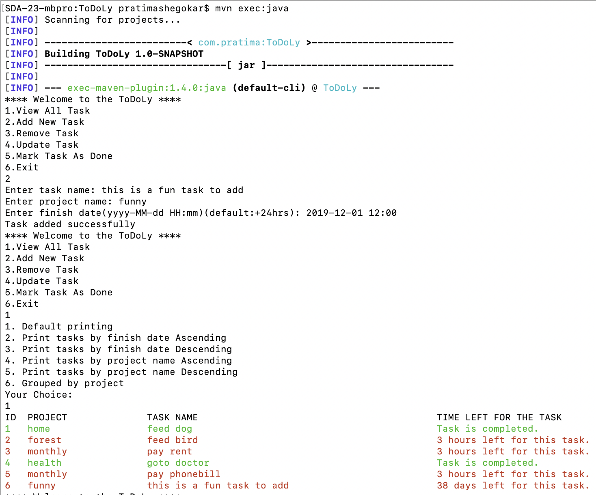
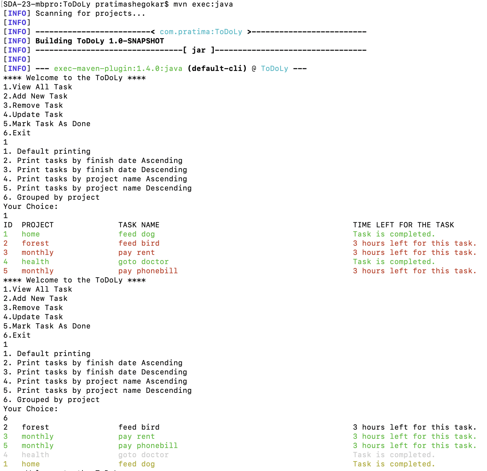
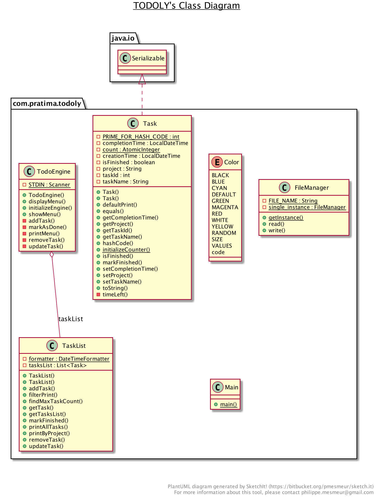

# ToDoLy
#### Individual Project for SDA6.


[](https://travis-ci.org/pratima-shegokar/ToDoLy)

## Key Features
- A CLI todo-list with CRUD operations.
- Menu driven operations.
- Add project to which a Task belongs to
- Automated CI builds (On travis)
- Serializes to raw format, smaller text file
- Multiple printing options
- Colors :tada:

## Dependencies
To run you need to have `java 11.0` and `mvn` installed locally.

## How to run
Run the following command to execute the program.
````shell script
$ git clone https://github.com/pratima-shegokar/ToDoLy.git
$ cd ToDoLy
$ mvn clean verify install
$ mvn exec:java
````
## Screenshots



## How to contribute
This project is for learning purposes made by me. 
Although I do not expect anybody to contribute, but if somebody decides to then just make a PR.

## Class Diagram


## Licence
This project is licenced under WTFPL. Read detailed licence text [here](http://www.wtfpl.net). 